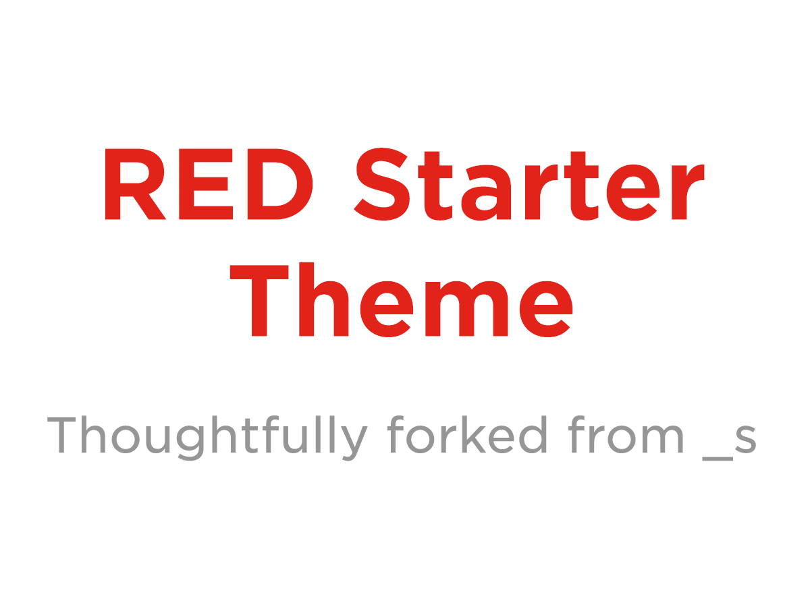

Inhabitent - Website that displays a mixture of camping blogs and posts of camping related items for sale.

Technologies used:

Wordpress - Used custom theme to organize pages and posts.

Javascript - jQuery was used to enable a function on the search bar to expand and contract using blur and focus.

PHP/HTML - Used PHP functions for the backbone display of the website.

Sass - Used to style website and include Mixins for organization.

Fontawesome - Icons for media (google+, instagram, twitter): https://fontawesome.com/icons?d=gallery

Learned/relection:
Working with WordPress (WP) is an intuitive and easy way to organize and build a dynamic website. Learning the proper hierarchy is essential to working with WP to maintain proper functionality. I started using Sass more efficiently to help make css more organized.

- Jeff Liknes, Red Academy 2018

# RED Starter

A WordPress starter theme for RED Academy students, forked from Underscores.

## Installation

### 1. Download me (don't clone me!)

Then add me to your `wp-content` directory.

### 2. Rename the `redstarter-master` directory

Make sure that the theme directory name is project appropriate!

### 3. Install the dev dependencies

Next you'll need to run `npm install` **inside your theme directory** next to install the node modules you'll need for Gulp, etc.

### 4. Update the proxy in `gulpfile.js`

Lastly, be sure to update your `gulpfile.js` with the appropriate URL for the Browsersync proxy (so change `localhost[:port-here]/[your-dir-name-here]` to the appropriate localhost URL).

author Jeff Liknes
